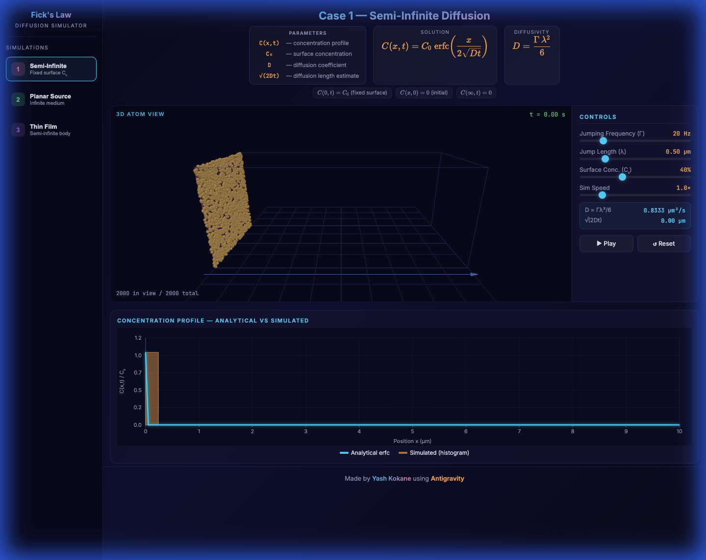
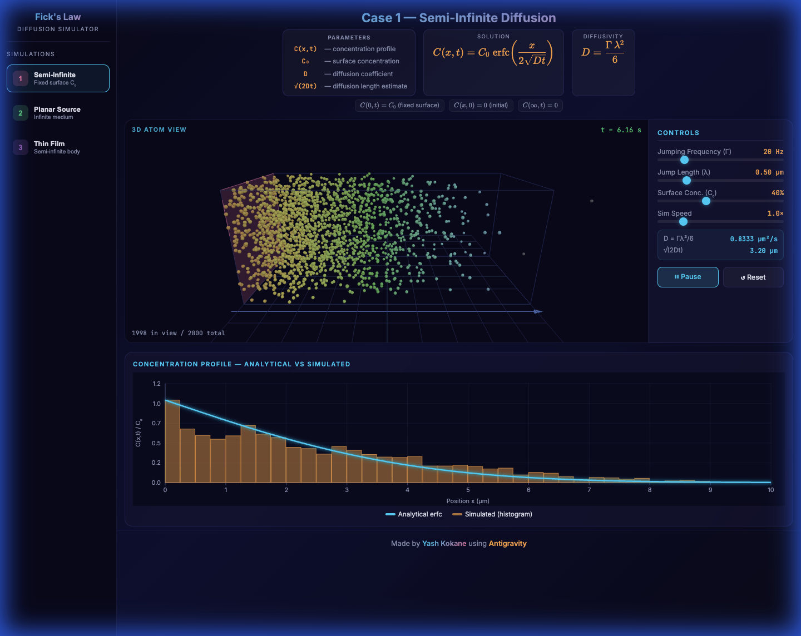
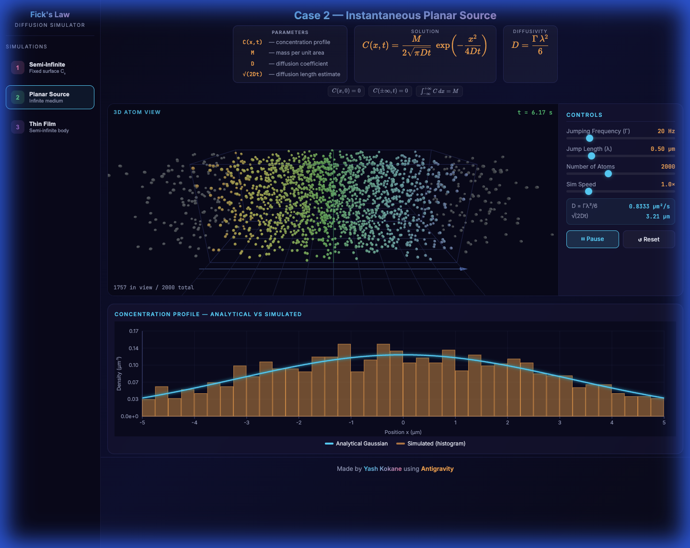
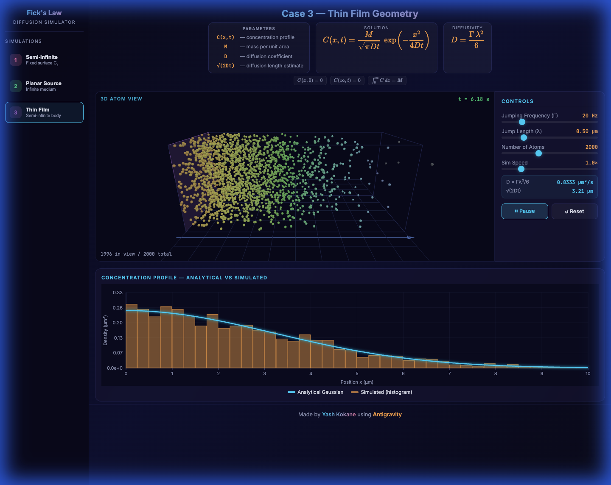

# Fick's Law — 3D Diffusion Simulator


An interactive 3D particle simulator that visualizes atomic diffusion governed by Fick's laws. Built as a personal exploration project alongside the **Kinetics** course at **Rensselaer Polytechnic Institute**, taught by **Prof. Jian Shi** (not for grades — just because diffusion is fascinating). Vibe-coded overnight for fun using [Antigravity](https://antigravity.dev).



## Demo


<iframe width="560" height="315" src="[[https://www.youtube.com/embed/video-id](https://github.com/cocokane/DiffusionModels/blob/main/screenshots/demo.mp4)](https://github.com/cocokane/DiffusionModels/blob/main/screenshots/demo.mp4)" frameborder="0" allow="accelerometer; autoplay; clipboard-write; encrypted-media; gyroscope; picture-in-picture" allowfullscreen></iframe>


---

## What This Simulates

This simulator models **three canonical diffusion problems** from Fick's second law. Each case represents a different set of initial/boundary conditions, producing a distinct analytical solution. Atoms undergo a **3D random walk** — at each timestep, an atom jumps a distance λ in a random direction with probability Γ·dt — and the resulting 1D concentration profile C(x,t) is compared in real-time against the exact analytical solution.

### The Physics: Fick's Second Law

The underlying PDE is:

$$\frac{\partial C}{\partial t} = D \frac{\partial^2 C}{\partial x^2}$$

where the **diffusion coefficient** is derived from the random walk parameters:

$$D = \frac{\Gamma \lambda^2}{6}$$

### Simulation Parameters

| Symbol | Name | Default | Description |
|--------|------|---------|-------------|
| **Γ** | Jumping Frequency | 20 Hz | How often each atom attempts a jump |
| **λ** | Jump Length | 0.50 µm | Distance traveled per jump |
| **D** | Diffusion Coefficient | 0.8333 µm²/s | Derived: D = Γλ²/6 |
| **√(2Dt)** | Diffusion Length | — | Characteristic spread distance at time t |
| **N** | Number of Atoms | 2000 | Total atoms in the simulation (Cases 2 & 3) |
| **C₀** | Surface Concentration | 40% | Relative source strength (Case 1 only) |

### Boundary Conditions

- **y, z directions**: Periodic boundary conditions — atoms exiting one side re-enter from the opposite side
- **x direction**: Case-specific (see below)

---

##  The Three Cases

### Case 1 — Semi-Infinite Diffusion (Constant Surface Concentration)

$$C(x,t) = C_0 \;\text{erfc}\!\left(\frac{x}{2\sqrt{Dt}}\right)$$

A surface held at constant concentration C₀ drives diffusion into a semi-infinite body. Atoms that cross back past x = 0 are reset to the surface (modeling an inexhaustible reservoir). The plot compares the simulated histogram against the complementary error function (erfc).

**Boundary conditions:** C(0,t) = C₀ (fixed surface), C(x,0) = 0 (initial), C(∞,t) = 0



---

### Case 2 — Instantaneous Planar Source (Infinite Medium)

$$C(x,t) = \frac{M}{2\sqrt{\pi D t}} \exp\!\left(-\frac{x^2}{4Dt}\right)$$

An instantaneous deposit of mass M at x = 0 spreads symmetrically into an infinite medium. The concentration profile is a Gaussian whose peak decreases as 1/√t while the width grows as √t. Total mass is conserved.

**Boundary conditions:** C(x,0) = 0, C(±∞,t) = 0, ∫C dx = M



---

### Case 3 — Thin Film on Semi-Infinite Substrate

$$C(x,t) = \frac{M}{\sqrt{\pi D t}} \exp\!\left(-\frac{x^2}{4Dt}\right)$$

A thin film deposited at x = 0 diffuses into a semi-infinite substrate (x ≥ 0). The boundary at x = 0 is **reflecting** — atoms attempting to cross leftward are bounced back. This doubles the prefactor compared to Case 2 (all mass stays on one side).

**Boundary conditions:** C(x,0) = 0, C(∞,t) = 0, ∫₀^∞ C dx = M



---

## How It Actually Works (Implementation Notes)

### It's Not Really Infinite

The analytical solutions assume infinite (or semi-infinite) domains. Obviously, we can't simulate infinity. Instead, the **simulation domain is 10× larger** than what's shown on screen:

- **Visible window**: 10 µm (what you see in the 3D viewport and the concentration plot)
- **Actual simulation domain**: 100 µm (atoms can freely diffuse out to ±50 µm or 0–100 µm)

This means atoms won't hit the far boundary and bounce back until they've traveled 10× the visible range — by which point the concentration in the visible region matches the analytical solution well. Atoms that diffuse beyond the visible box appear as **dim grey spheres** in the 3D view, and the status bar shows how many are "in view" vs total.

### The Random Walk

Each atom performs a 3D isotropic random walk:
1. At each sub-timestep, the atom has probability Γ·dt of jumping
2. If it jumps, it picks a **random direction** on the unit sphere (uniform θ, φ)
3. It moves distance λ in that direction
4. Boundary conditions in x are applied per-case; y and z use periodic BCs

The diffusion coefficient D = Γλ²/6 emerges naturally from the 3D random walk statistics (the factor of 6 comes from 3 spatial dimensions × 2 directions each).

### Concentration Profile Comparison

- **Case 1**: The histogram is normalized by the count in the first bin (x ≈ 0), giving C/C₀ on a fixed [0, 1] scale
- **Cases 2 & 3**: The histogram is converted to **probability density** (count / (N × bin width)) and compared against the analytical PDF. The y-axis auto-scales every 0.5 seconds

---

##  Quick Start

### Prerequisites

- Any modern browser (Chrome, Firefox, Safari, Edge)
- A local HTTP server (due to ES module imports)

### Run It

```bash
# Clone the repo
git clone https://github.com/yashkokane/DiffusionModels.git
cd DiffusionModels

# Serve locally (pick any method)
python3 -m http.server 8085
# or
npx serve -p 8085
# or
php -S localhost:8085
```

Then open [http://localhost:8085](http://localhost:8085) in your browser.

### Usage

1. **Pick a case** from the sidebar (1, 2, or 3)
2. **Adjust parameters** using the control sliders:
   - Γ (jumping frequency) and λ (jump length) control the diffusion speed
   - Number of Atoms / Surface Concentration controls statistical quality
   - Sim Speed scales the simulation clock
3. **Hit Play** and watch the atoms diffuse
4. The **concentration plot** overlays the simulated histogram (orange) against the analytical solution (cyan)
5. The **3D view** shows atoms colored by position — warm (near source) to cool (far away)

---

## Project Structure

```
DiffusionModels/
├── index.html          # HTML structure, CSS, KaTeX headers, sidebar
├── js/
│   ├── simulation.js   # DiffusionSim engine: random walk, BCs, analytics
│   ├── renderer.js     # SceneManager (Three.js 3D) + PlotManager (Canvas 2D)
│   └── main.js         # Controls, case switching, animation loop
├── screenshots/        # README assets
└── README.md
```

### Dependencies (all via CDN, zero install)

- [Three.js](https://threejs.org/) v0.163.0 — 3D rendering
- [KaTeX](https://katex.org/) — LaTeX equation rendering
- [Inter](https://fonts.google.com/specimen/Inter) + JetBrains Mono — typography

---

## License

This is a personal project, feel free to use it however you'd like.

---

*Made by [Yash Kokane](https://github.com/yashkokane) using [Antigravity](https://antigravity.dev) — for the Kinetics course at RPI, taught by Prof. Jian Shi.*
